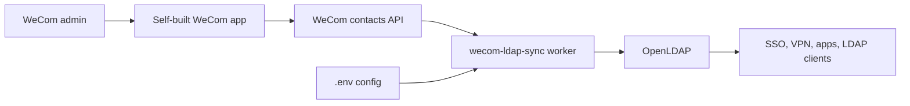

# Architecture

`wecom-ldap-sync` is a small sync worker that reads the WeCom directory API and writes a matching view into LDAP. It is designed to run inside the same Docker network as OpenLDAP, so the sync container does not need an exposed public port.

## Data Flow

1. A WeCom admin creates a self-built app and grants contacts read permission.
2. The sync worker reads `WECOM_CORPID`, `WECOM_CORPSECRET`, LDAP settings, and sync options from `.env`.
3. On startup, the worker fetches departments and users from WeCom.
4. It creates or updates LDAP OUs and user entries.
5. It repeats on `SYNC_INTERVAL_MINUTES`.

## Runtime Components

| Component | Role |
| --- | --- |
| `wecom-ldap-sync` | Python worker that fetches WeCom contacts and writes LDAP entries. |
| `openldap` | Reference OpenLDAP server used by `compose.yml`. You can point the worker at another LDAP server instead. |
| `.env` | Runtime configuration for WeCom credentials, LDAP connection, password defaults, sync interval, and dry-run mode. |

## LDAP Writes

The worker manages the LDAP representation of the WeCom directory:

- Creates a matching OU hierarchy for departments.
- Creates or updates user attributes such as name, alias, title, department, and email.
- Sets `LDAP_DEFAULT_PASSWORD` for new users and for existing users that do not have a password.
- Does not overwrite an existing user password.
- Optionally deletes users no longer present in WeCom when `SYNC_DELETE_ORPHANS=true`.

## Security Notes

- Keep `WECOM_CORPSECRET`, `LDAP_ADMIN_PASSWORD`, and `LDAP_DEFAULT_PASSWORD` out of source control.
- Use `DRY_RUN=true` before first production sync to inspect intended LDAP changes.
- Be careful with `SYNC_DELETE_ORPHANS=true` on the first run against an existing LDAP directory.
- Only expose LDAP ports to trusted LAN clients that need them.
- Add only the sync server's outbound public IP to the WeCom app trusted IP list.

## Operational Boundaries

This project is intentionally narrow. It mirrors WeCom contacts into LDAP; it is not an IdP, HR system, password reset portal, or SSO provider. It works best as the directory source feeding existing LDAP-aware tools.

